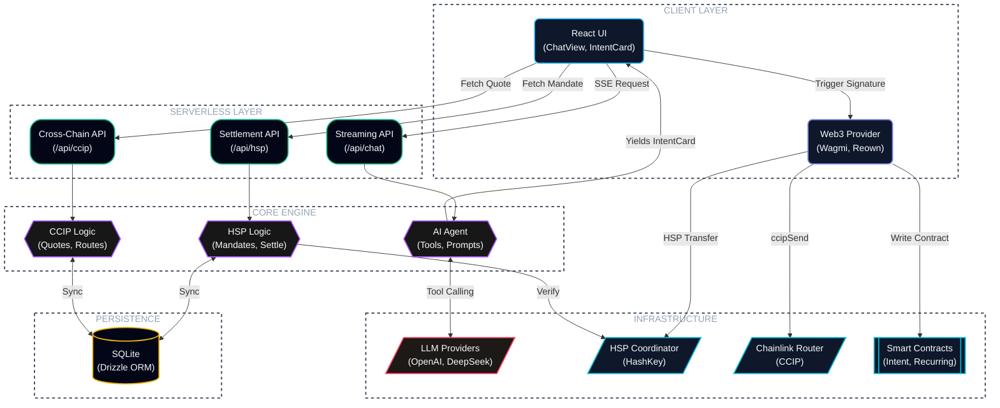

<p align="center">
  
</p>

## Table of Contents
- [HSK.ai](#hskai)
- [Features](#features)
- [Supported Chains](#supported-chains)
- [Installation](#installation)
- [Architecture](#architecture)


# HSK.ai

Every hard problem in Web3 settlement has quietly been solved over the last few years — finality, cross-chain messaging, cryptographic authorization. The part nobody fixed is the fifteen minutes before any of that matters, where a person has to figure out which chain they're on, copy an address correctly, and hope the gas estimate holds. HSK.ai removes that fifteen minutes. Tell it who to pay and how much, and the sentence itself becomes the transaction — parsed, routed, and carried through to on-chain finality without a form, a chain switch, or a pasted address in sight.

Nothing about the interface asks the user to think like an engineer. Name the recipient, the amount, the asset. The system takes it from there.

The complexity is real, it's just been moved somewhere the user never has to look. A single instruction sends the agent through recipient resolution against a stored contact graph, live balance checks across nine independently connected EVM networks, and construction of an EIP-712 payment mandate — all resolved before anything is ever put in front of the user for approval. If the payment needs to leave its origin chain, HSK.ai routes CCIP-BnM assets from Ethereum Sepolia to Base, Arbitrum, Optimism, Polygon, or Avalanche through Chainlink's CCIP network, pricing the bridge fee straight off the router contract in the moment rather than estimating it in advance. What would normally take several disconnected tools and a fair amount of trust collapses into one intent card the user can actually read: recipient, route, fee, settlement path, all in one place, all reviewed before a single signature is requested. The wallet signs; HSK.ai never holds, touches, or has custody of the funds at any point.

The part that separates this from a chatbot bolted onto a bridge SDK is that nothing gets handed off once the intent is parsed. The agent rides with the payment through broadcast, confirmation, and settlement, and closes the loop with a receipt that can be checked independently rather than taken on faith. Every intent is also written permanently to HashKey Mainnet, so a transaction run entirely on testnet still leaves behind the same kind of durable, checkable record that a live payment would.

Demo Link (BETA): https://hskai.netlify.app

## Features

- **Multilingual** — Full English and Japanese UI, with the language switch taking effect immediately, no reload, no lost state
- **Multichain** — WalletConnect / Reown AppKit handles wallet connection and provisions all 9 supported chains on its own (HashKey Testnet & Mainnet, Ethereum, Sepolia, Base Sepolia, Arbitrum Sepolia, OP Sepolia, Polygon Amoy, Avalanche Fuji); cross-chain settlement runs through the Chainlink CCIP Router, with HashKey Chain as the home network
- **AI Chat Interface** — A tool-calling agent that turns a plain sentence into a structured, reviewable payment — nothing moves until the request has been compiled into an intent card the user can actually read
- **HSP Integration** — Wired directly into the HashKey Payment (HSP) SDK for mandate signing, coordinator registration, and settlement that resolves to a linked, verifiable explorer record rather than a bare transaction hash
- **Cross-Chain CCIP Bridge** — Moves CCIP-BnM assets from Ethereum Sepolia to Base, Arbitrum, Optimism, Polygon, or Avalanche testnets through Chainlink CCIP, with live fee quoting, handled ERC-20 approvals, and CCIP explorer message tracking end to end (testnet-only for now)
- **Payment Intent Anchoring** — Every intent hash gets written permanently to HashKey Chain Mainnet (chain ID 177) as standing proof it happened, with the wallet auto-switching networks and anchoring status tracked live against the deployed mainnet and testnet contracts
- **Recurring Payments** — Recurring USDC transfers are registered on-chain through the HSKRecurringAnchor contract on HashKey Mainnet — weekly, biweekly, or monthly — with a running record of every execution
- **Contacts & Address Book** — Save a name once, and the agent resolves it to the right wallet address on its own from then on — no more hunting for a 42-character string in your notes app
- **Payment History** — One log covering status, anchoring, HSP verification, and CCIP message tracking, so there's never a reason to check four different places for the state of a payment
- **Token Balance Awareness** — Native (HSK/ETH) and ERC-20 (USDC, CCIP-BnM) balances stay live across every connected chain, so the agent's suggestions are grounded in what you can actually afford to send
- **Multi-Provider AI** — Bring your own key for OpenAI, DeepSeek, Kimi, local Ollama, or any OpenAI-compatible endpoint; the key lives in browser localStorage and never touches a server
- **Intent Confirmation Flow** — Every payment stops at a structured intent card — recipient, amount, token, network, fee breakdown, settlement route — and waits for the user before anything is broadcast
- **Transaction Receipt Tracking** — Block confirmations, revert detection, and finalization status tracked live via viem's `waitForTransactionReceipt`, so you're watching the payment settle, not guessing whether it did

## Installation

Getting from a clean clone to a signed transaction takes five commands and no configuration guesswork — the app tells you exactly what's missing as you go.

### Prerequisites

- [Node.js](https://nodejs.org/) 18+ and npm
- A wallet (MetaMask, Rabby, etc.)
- An AI provider API key (OpenAI, DeepSeek, or any OpenAI-compatible endpoint)

### Steps

```bash
git clone --recursive https://github.com/SuReaper/HSK.ai.git
cd HSK.ai
```
<p align="center">
  
</p>

```bash
npm install
```
<p align="center">
  
</p>

```bash
cp .env.example .env.local
```
<p align="center">
  
</p>

```bash
#    Register at https://hsp-hackathon.hashkeymerchant.com/register
#    Set HSP_API_KEY in .env.local
#    Without it the app runs in read-only mode (observe + verify, no settle).
```
<p align="center">
  
</p>

```bash
npx next build --webpack
npx next start
```
<p align="center">
  
</p>

Now open [http://localhost:3000](http://localhost:3000).

### Post-Setup for testing

1. **Connect your wallet** — the app provisions all 9 supported chains automatically on connection
2. **Configure your AI provider** — click the gear ⚙️ next to the chat input, enter your API key and endpoint
3. **Get test tokens** — for CCIP-BnM tokens, visit the [CCIP Faucet](https://faucets.chain.link/ccip); for HSK testnet tokens, use the HashKey Testnet faucet
4. **Start chatting** — try "Send 0.01 CCIP-BnM to Alice on Base Sepolia" or "Send 5 USDC to Bob or this or that address."
5. Switch to mainnet at any time to settle against HashKey Chain Mainnet directly.
> If `--recursive` was forgotten during clone, run `git submodule update --init` to fetch the HSP SDK.

## Supported Chains

Nine networks are wired in from day one, spanning HSK's own chains and the major EVM testnets used for cross-chain settlement:

| Chain | ID |
|---|---|
| HashKey Testnet | 133 |
| HashKey Mainnet | 177 |
| Ethereum Sepolia | 11155111 |
| Base Sepolia | 84532 |
| Arbitrum Sepolia | 421614 |
| Optimism Sepolia | 11155420 |
| Polygon Amoy | 80002 |
| Avalanche Fuji | 43113 |

## Architecture

Four layers, each doing one job: the client captures intent and gets it signed, the serverless layer routes requests, the core engine does the actual reasoning and mandate-building, and the on-chain layer is where the payment becomes real.


