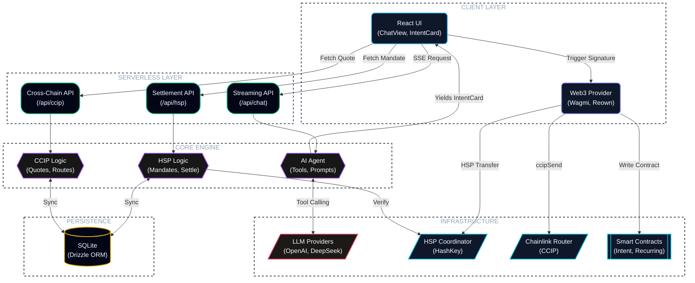

<p align="center">
  
</p>

## Table of Contents
- [HSK.ai](#hskai)
- [Features](#features)
- [Supported Chains](#supported-chains)
- [Installation](#installation)
- [Architecture](#architecture)


# HSK.ai

The primitives underlying modern Web3 infrastructure — settlement rails, cross-chain messaging, mandate-based authorization — have matured considerably. What hasn't kept pace is the interface layer sitting on top of them: users are still expected to reason in terms of contract addresses, RPC endpoints, chain IDs, and gas parameters just to move value from one place to another. HSK.ai exists to collapse that interface gap by translating natural-language payment intent directly into verifiable on-chain settlement.

Rather than requiring users to construct transactions themselves, HSK.ai accepts a conversational instruction — who to pay, how much, in what asset — and resolves the entire execution path on their behalf.

That resolution path is where most of the system's complexity lives. On receiving an instruction, the agent disambiguates the recipient against a locally-resolved contact graph, aggregates live token balances across nine independently-connected EVM networks, constructs an EIP-712-typed payment mandate, and coordinates settlement through the HashKey Settlement Protocol (HSP). Where a transfer spans chains, the system routes CCIP-BnM assets from Ethereum Sepolia to Base, Arbitrum, Optimism, Polygon, or Avalanche via Chainlink's CCIP messaging network, pulling live bridge-fee quotes directly from the router contract at request time. The full resolution — recipient, route, fees, and settlement path — is compiled into a single reviewable intent card before anything is signed. No transaction is broadcast without explicit, wallet-level user authorization; the system never holds custody of funds at any point in the flow.

The underlying design principle is that conversational parsing and on-chain settlement are treated as one continuous pipeline rather than two separate concerns. HSK.ai doesn't stop at interpreting intent — it stays attached to the payment through broadcast, confirmation tracking, and final settlement, closing the loop with a cryptographically verifiable receipt. Every payment intent is additionally anchored as an immutable record on HashKey Mainnet, so that even activity executed against testnet infrastructure inherits the auditability properties of a production settlement layer.

Demo Link (BETA): https://hskai.netlify.app

## Features

- **Multilingual** — Full English and Japanese UI with runtime language switching
- **Multichain** — WalletConnect / Reown AppKit integration with automatic network provisioning across all 9 supported chains (HashKey Testnet & Mainnet, Ethereum, Sepolia, Base Sepolia, Arbitrum Sepolia, OP Sepolia, Polygon Amoy, Avalanche Fuji); cross-chain settlement via the Chainlink CCIP Router, with HashKey Chain as the primary execution environment
- **AI Chat Interface** — Natural-language payment parsing backed by a tool-calling agent loop that compiles every request into a reviewable intent card prior to fund movement
- **HSP Integration** — On-chain verifiable payment proofs via the HashKey Payment (HSP) SDK, covering mandate signing, coordinator registration, and cryptographically verifiable settlement with linked explorer records
- **Cross-Chain CCIP Bridge** — CCIP-BnM asset transfers from Ethereum Sepolia to Base, Arbitrum, Optimism, Polygon, or Avalanche testnets via Chainlink CCIP; includes client-side fee quoting, ERC-20 approval handling with receipt confirmation, and CCIP explorer message tracking (currently testnet-only)
- **Payment Intent Anchoring** — Immutable recording of payment intent hashes on HashKey Chain Mainnet (chain ID 177) as on-chain proof of intent, with automatic wallet-network switching and anchoring-status tracking against deployed mainnet and testnet contracts
- **Recurring Payments** — Automated recurring USDC transfer scheduling registered on-chain via the HSKRecurringAnchor contract on HashKey Mainnet, supporting weekly, biweekly, or monthly cadences with full execution tracking
- **Contacts & Address Book** — Persistent contact resolution layer allowing the agent to map human-readable labels to wallet addresses automatically
- **Payment History** — Complete transaction log including status, anchoring records, HSP verification state, and CCIP message tracking
- **Token Balance Awareness** — Live native (HSK/ETH) and ERC-20 (USDC, CCIP-BnM) balance aggregation across all connected chains, feeding directly into the agent's payment recommendations
- **Multi-Provider AI** — Bring-your-own-key architecture supporting OpenAI, DeepSeek, Kimi, local Ollama, or any OpenAI-compatible endpoint; credentials are held client-side in browser localStorage and never transmitted to or stored on the server
- **Intent Confirmation Flow** — Every payment requires explicit user confirmation through a structured intent card detailing recipient, amount, token, network, fee breakdown, and settlement route prior to broadcast
- **Transaction Receipt Tracking** — Real-time block confirmation monitoring, revert detection, and finalization status via viem's `waitForTransactionReceipt`

## Installation

### Prerequisites

- [Node.js](https://nodejs.org/) 18+ and npm
- A wallet (MetaMask, Rabby, etc.)
- An AI provider API key (OpenAI, DeepSeek, or any OpenAI-compatible endpoint)

### Steps

```bash
git clone --recursive https://github.com/SuReaper/HSK.ai.git
cd HSK.ai
```
<p align="center">
  
</p>

```bash
npm install
```
<p align="center">
  
</p>

```bash
cp .env.example .env.local
```
<p align="center">
  
</p>

```bash
#    Register at https://hsp-hackathon.hashkeymerchant.com/register
#    Set HSP_API_KEY in .env.local
#    Without it the app runs in read-only mode (observe + verify, no settle).
```
<p align="center">
  
</p>

```bash
npx next build --webpack
npx next start
```
<p align="center">
  
</p>

Now open [http://localhost:3000](http://localhost:3000).

### Post-Setup for testing

1. **Connect your wallet** — the app provisions all 9 supported chains automatically on connection
2. **Configure your AI provider** — click the gear ⚙️ next to the chat input, enter your API key and endpoint
3. **Get test tokens** — for CCIP-BnM tokens, visit the [CCIP Faucet](https://faucets.chain.link/ccip); for HSK testnet tokens, use the HashKey Testnet faucet
4. **Start chatting** — try "Send 0.01 CCIP-BnM to Alice on Base Sepolia" or "Send 5 USDC to Bob or this or that address."
5. Switch to mainnet at any time to settle against HashKey Chain Mainnet directly.
> If `--recursive` was forgotten during clone, run `git submodule update --init` to fetch the HSP SDK.

## Supported Chains

| Chain | ID |
|---|---|
| HashKey Testnet | 133 |
| HashKey Mainnet | 177 |
| Ethereum Sepolia | 11155111 |
| Base Sepolia | 84532 |
| Arbitrum Sepolia | 421614 |
| Optimism Sepolia | 11155420 |
| Polygon Amoy | 80002 |
| Avalanche Fuji | 43113 |

## Architecture


What really ties it together is pairing conversational AI with genuine on-chain settlement. HSK.ai doesn't just figure out what you're asking for—it stays with the payment through its full lifecycle: parsing the intent, broadcasting the transaction, tracking confirmations, and returning a cryptographic receipt once everything settles. Each payment is also anchored to a permanent record on HashKey Mainnet, so even testnet activity carries the kind of verifiability you'd expect from a live production network.

Demo Link (BETA): https://hskai.netlify.app

## Features


- **Multilingual** — Full English and Japanese UI with runtime language switching
- **Multichain** — WalletConnect / Reown AppKit with auto-add for all 9 supported networks (HashKey Testnet & Mainnet, Ethereum, Sepolia, Base Sepolia, Arbitrum Sepolia, OP Sepolia, Polygon Amoy, Avalanche Fuji); cross-chain transfers via Chainlink CCIP Router — primarily built for HashKey Chain
- **AI Chat Interface** — Natural language payments; tool-calling flow creates reviewable intent cards before any funds move
- **HSP Integration** — On-chain verifiable payment proofs via HashKey Payment (HSP) SDK; mandate signing, coordinator registration, and verifiable settlement with explorer links
- **Cross-Chain CCIP Bridge** — Send CCIP-BnM tokens from Ethereum Sepolia to Base, Arbitrum, Optimism, Polygon, or Avalanche testnets via Chainlink CCIP; client-side fee quotes, ERC-20 approval flow with receipt confirmation, and CCIP explorer message tracking (CCIP is currently only for testnet.)
- **Payment Intent Anchoring** — Permanently record payment intent hashes on HashKey Chain Mainnet (177) as on-chain proof; auto wallet-switch with anchoring status tracking. Deployed Contracts on mainnet and testnet.
- **Recurring Payments** — Schedule automated recurring USDC transfers registered on-chain via HSKRecurringAnchor contract on HashKey Mainnet; weekly, biweekly, or monthly cadence with execution tracking
- **Contacts & Address Book** — Save and resolve contacts by name; AI resolves labels to addresses automatically from contact list
- **Payment History** — Full transaction log with status, anchors, HSP verification, and CCIP message tracking
- **Token Balance Awareness** — AI sees your native (HSK/ETH) and ERC-20 (USDC, CCIP-BnM) balances across all connected chains to make informed payment suggestions
- **Multi-Provider AI** — Bring-your-own-key support for OpenAI, DeepSeek, Kimi, local Ollama, or any OpenAI-compatible endpoint; key stored in browser localStorage, never on server
- **Intent Confirmation Flow** — Every payment requires explicit user confirmation via a rich intent card showing recipient, amount, token, network, fees, and settlement path before any transaction is broadcast
- **Transaction Receipt Tracking** — Live block confirmations, revert detection, and finalization status via viem `waitForTransactionReceipt`

## Installation

### Prerequisites

- [Node.js](https://nodejs.org/) 18+ and npm
- A wallet (MetaMask, Rabby, etc.)
- An AI provider API key (OpenAI, DeepSeek, or any OpenAI-compatible endpoint)

### Steps

```bash
git clone --recursive https://github.com/SuReaper/HSK.ai.git
cd HSK.ai
```
<p align="center">
  
</p>

```bash
npm install
```
<p align="center">
  
</p>

```bash
cp .env.example .env.local
```
<p align="center">
  
</p>

```bash
#    Register at https://hsp-hackathon.hashkeymerchant.com/register
#    Set HSP_API_KEY in .env.local
#    Without it the app runs in read-only mode (observe + verify, no settle).
```
<p align="center">
  
</p>

```bash
npx next build --webpack
npx next start
```
<p align="center">
  
</p>

Now open [http://localhost:3000](http://localhost:3000).

### Post-Setup for testing

1. **Connect your wallet** — the app auto-adds all 9 supported chains on connection
2. **Configure your AI provider** — click the gear ⚙️ next to the chat input, enter your API key and endpoint
3. **Get test tokens** — for CCIP-BnM tokens, visit the CCIP Faucet; for HSK testnet tokens, use the HashKey Testnet faucet
4. **Start chatting** — try "Send 0.01 CCIP-BnM to Alice on Base Sepolia" or "Send 5 USDC to Bob or this or that address."
5. You may switch to mainnet anytime for the HashKey Chain Mainnet.
> If `--recursive` was forgotten during clone, run `git submodule update --init` to fetch the HSP SDK.


## Supported Chains

| Chain | ID |
|---|---|
| HashKey Testnet | 133 |
| HashKey Mainnet | 177 |
| Ethereum Sepolia | 11155111 | 
| Base Sepolia | 84532 |
| Arbitrum Sepolia | 421614 |
| Optimism Sepolia | 11155420 |
| Polygon Amoy | 80002 |
| Avalanche Fuji | 43113 |


## Architecture

