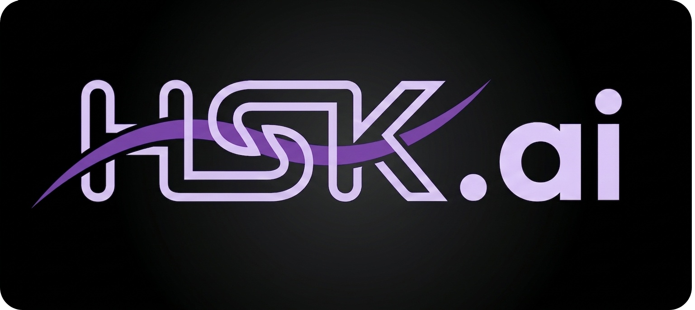
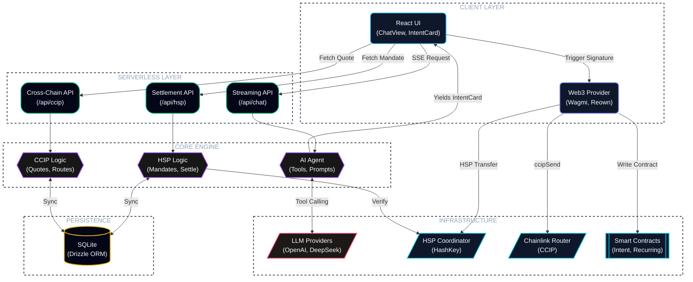

<p align="center">
  
</p>

## Table of Contents
- [HSK.ai](#hskai)
- [Features](#features)
- [Supported Chains](#supported-chains)
- [Installation](#installation)
- [Architecture](#architecture)


# HSK.ai

Web3 infrastructure has gotten genuinely powerful over the past few years, but let's be honest—most people still can't use it without running into a wall of contract addresses, chain switches, and wallet menus that only make sense if you already know what you're doing. That's the gap HSK.ai is built to close.

Instead of making users think in blockchain terms, HSK.ai lets them just say what they want done. Tell it who to pay and how much, and the assistant handles everything from there.

Behind that simple request, there's a fair amount happening under the hood. The assistant resolves contact names, checks token balances across nine connected chains, builds out EIP-712 mandates, and communicates directly with the HashKey Settlement Protocol (HSP) to get the payment moving. When a transfer needs to cross chains, it routes CCIP-BnM tokens from Ethereum Sepolia over to Base, Arbitrum, Optimism, Polygon, or Avalanche through Chainlink's CCIP network, pulling bridge fees straight from the router contract in real time. All of that gets condensed into a single, easy-to-read confirmation card. Nothing goes through without the user's sign-off—every action still requires approval through their own non-custodial wallet.

What really ties it together is pairing conversational AI with genuine on-chain settlement. HSK.ai doesn't just figure out what you're asking for—it stays with the payment through its full lifecycle: parsing the intent, broadcasting the transaction, tracking confirmations, and returning a cryptographic receipt once everything settles. Each payment is also anchored to a permanent record on HashKey Mainnet, so even testnet activity carries the kind of verifiability you'd expect from a live production network.

## Features


- **Multilingual** — Full English and Japanese UI with runtime language switching
- **Multichain** — WalletConnect / Reown AppKit with auto-add for all 9 supported networks (HashKey Testnet & Mainnet, Ethereum, Sepolia, Base Sepolia, Arbitrum Sepolia, OP Sepolia, Polygon Amoy, Avalanche Fuji); cross-chain transfers via Chainlink CCIP Router — primarily built for HashKey Chain
- **AI Chat Interface** — Natural language payments; tool-calling flow creates reviewable intent cards before any funds move
- **HSP Integration** — On-chain verifiable payment proofs via HashKey Payment (HSP) SDK; mandate signing, coordinator registration, and verifiable settlement with explorer links
- **Cross-Chain CCIP Bridge** — Send CCIP-BnM tokens from Ethereum Sepolia to Base, Arbitrum, Optimism, Polygon, or Avalanche testnets via Chainlink CCIP; client-side fee quotes, ERC-20 approval flow with receipt confirmation, and CCIP explorer message tracking (CCIP is currently only for testnet.)
- **Payment Intent Anchoring** — Permanently record payment intent hashes on HashKey Chain Mainnet (177) as on-chain proof; auto wallet-switch with anchoring status tracking
- **Recurring Payments** — Schedule automated recurring USDC transfers registered on-chain via HSKRecurringAnchor contract on HashKey Mainnet; weekly, biweekly, or monthly cadence with execution tracking
- **Contacts & Address Book** — Save and resolve contacts by name; AI resolves labels to addresses automatically from contact list
- **Payment History** — Full transaction log with status, anchors, HSP verification, and CCIP message tracking
- **Token Balance Awareness** — AI sees your native (HSK/ETH) and ERC-20 (USDC, CCIP-BnM) balances across all connected chains to make informed payment suggestions
- **Multi-Provider AI** — Bring-your-own-key support for OpenAI, DeepSeek, Kimi, local Ollama, or any OpenAI-compatible endpoint; key stored in browser localStorage, never on server
- **Intent Confirmation Flow** — Every payment requires explicit user confirmation via a rich intent card showing recipient, amount, token, network, fees, and settlement path before any transaction is broadcast
- **Transaction Receipt Tracking** — Live block confirmations, revert detection, and finalization status via viem `waitForTransactionReceipt`

## Installation

### Prerequisites

- [Node.js](https://nodejs.org/) 18+ and npm
- A wallet (MetaMask, Rabby, etc.)
- An AI provider API key (OpenAI, DeepSeek, or any OpenAI-compatible endpoint)

### Steps

```bash
git clone --recursive https://github.com/SuReaper/HSK.ai.git
cd HSK.ai
```
<p align="center">
  
</p>

```bash
npm install
```
<p align="center">
  
</p>

```bash
cp .env.example .env.local
```
<p align="center">
  
</p>

```bash
#    Register at https://hsp-hackathon.hashkeymerchant.com/register
#    Set HSP_API_KEY in .env.local
#    Without it the app runs in read-only mode (observe + verify, no settle).
```
<p align="center">
  
</p>

```bash
npx next build --webpack
npx next start
```
<p align="center">
  
</p>

Now open [http://localhost:3000](http://localhost:3000).

### Post-Setup

1. **Connect your wallet** — the app auto-adds all 9 supported chains on connection
2. **Configure your AI provider** — click the gear ⚙️ next to the chat input, enter your API key and endpoint
3. **Get test tokens** — for CCIP-BnM tokens, visit the [CCIP Faucet](https://faucets.chain.link/ccip); for HSK testnet tokens, use the HashKey Testnet faucet
4. **Start chatting** — try "Send 0.01 CCIP-BnM to Alice on Base Sepolia" or "Send 5 USDC to Bob"

> If `--recursive` was forgotten during clone, run `git submodule update --init` to fetch the HSP SDK.


## Supported Chains

| Chain | ID |
|---|---|
| HashKey Testnet | 133 |
| HashKey Mainnet | 177 |
| Ethereum Sepolia | 11155111 | 
| Base Sepolia | 84532 |
| Arbitrum Sepolia | 421614 |
| Optimism Sepolia | 11155420 |
| Polygon Amoy | 80002 |
| Avalanche Fuji | 43113 |


## Architecture

