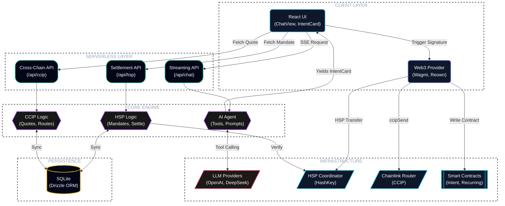

<p align="center">
  
</p>

<p align="center">
  <a href="https://hskai.netlify.app"></a>
  
  
  
  
</p>

## Table of Contents

- [HSK.ai](#hskai)
- [Features](#features)
- [How It Works](#how-it-works)
- [Tech Stack](#tech-stack)
- [Supported Chains](#supported-chains)
- [Smart Contracts](#smart-contracts)
- [Installation](#installation)
- [Environment Variables](#environment-variables)
- [API Reference](#api-reference)
- [Project Structure](#project-structure)
- [Architecture](#architecture)
- [Architecture Graph](#architecture-graph)
- [Scripts](#scripts)


# HSK.ai

Sending a crypto payment normally means knowing which chain you're on, having the right address, holding the right gas token, and — if the recipient is on a different chain — routing the asset through a bridge yourself. HSK.ai takes a plain-language instruction like "send 5 USDC to Bob" and does that resolution work in the background: matching the recipient, checking balances, picking a route, and getting the transaction signed and settled.

The part worth explaining is what happens between the sentence and the signature. A single instruction requires the agent to look up the recipient against a saved contact list, check native and token balances across nine separately connected chains to see whether the payment is even possible, and construct an EIP-712 typed mandate — a structured, signable payload rather than a raw transaction — for the HashKey Settlement Protocol (HSP) to act on. If the recipient is on a different chain than the sender, the agent routes CCIP-BnM tokens from Ethereum Sepolia to Base, Arbitrum, Optimism, Polygon, or Avalanche through Chainlink's CCIP network, and it does this by reading the fee quote directly off the router contract at request time rather than using a fixed estimate. All of that — who, how much, which route, what it costs — gets shown to the user as one intent card before anything is broadcast. The wallet, not HSK.ai, is what actually signs and holds the funds; the app never has custody at any point.

The agent doesn't stop once the intent is built, either. It stays attached through broadcast, block confirmations, and final settlement, and returns a receipt that can be checked independently against the chain rather than just trusted. Every payment intent is also written to HashKey Mainnet as a permanent record, so a transaction executed on testnet still leaves the same kind of traceable history a mainnet payment would.

Live Demo (BETA): https://hskai.netlify.app

## Features

- **Multilingual** — English and Japanese UI with runtime language switching; no reload required
- **Multichain** — WalletConnect / Reown AppKit connects the wallet and adds all 9 supported chains automatically (HashKey Testnet & Mainnet, Ethereum Mainnet & Sepolia, Base Sepolia, Arbitrum Sepolia, OP Sepolia, Polygon Amoy, Avalanche Fuji); cross-chain settlement runs through the Chainlink CCIP Router, with HashKey Chain as the primary network
- **AI Chat Interface** — A tool-calling agent that converts a plain-language request into a structured payment intent; nothing is broadcast until the request has been compiled into an intent card and confirmed
- **HSP Integration** — Uses the HashKey Payment (HSP) SDK for mandate signing, coordinator registration, and settlement, with each transaction linked to its explorer record
- **Cross-Chain CCIP Bridge** — Sends CCIP-BnM tokens from Ethereum Sepolia to Base, Arbitrum, Optimism, Polygon, or Avalanche testnets via Chainlink CCIP; includes live fee quoting, ERC-20 approval handling, and CCIP explorer message tracking (testnet-only for now)
- **Payment Intent Anchoring** — Writes each payment intent hash to HashKey Chain Mainnet (chain ID 177) as a permanent on-chain record, with automatic wallet-network switching and anchoring status tracked against the deployed mainnet and testnet contracts
- **Recurring Payments** — Schedules recurring USDC transfers on-chain through the HSKRecurringAnchor contract on HashKey Mainnet, on weekly, biweekly, or monthly cadences, with execution history tracked per schedule
- **Contacts & Address Book** — Save a name once and the agent resolves it to the correct wallet address automatically on future requests
- **Payment History** — One log covering transaction status, anchoring records, HSP verification, and CCIP message tracking
- **Token Balance Awareness** — Native (HSK/ETH) and ERC-20 (USDC, CCIP-BnM) balances are checked live across every connected chain, and the agent's suggestions are based on what's actually available
- **Multi-Provider AI** — Bring your own API key for OpenAI, DeepSeek, Kimi, local Ollama, or any OpenAI-compatible endpoint; the key is stored in browser localStorage and never sent to a server
- **Intent Confirmation Flow** — Every payment requires explicit confirmation via an intent card showing recipient, amount, token, network, fee breakdown, and settlement route before broadcast
- **Transaction Receipt Tracking** — Block confirmations, revert detection, and finalization status tracked live via viem's `waitForTransactionReceipt`

## How It Works

HSK.ai routes a natural-language payment request through three settlement paths depending on token type and destination:

### Same-Chain Stablecoin (HSP)

For USDC / USDC.e transfers on HashKey Chain, the agent uses the HashKey Settlement Protocol for verifiable settlement:

1. **Prepare** — The server builds an EIP-712 typed mandate (`/api/hsp/prepare`) containing the recipient, token, amount, deadline, and chain. The mandate hash becomes the HSP payment ID.
2. **Sign** — The user signs the mandate via `signTypedData` in their wallet. No gas, no tokens move — just a free cryptographic signature.
3. **Register** — The signed mandate is sent to the HSP Coordinator (`/api/hsp/register`) *before* the on-chain transfer. If the Coordinator rejects it (bad signature, policy violation), the flow aborts — no funds move.
4. **Transfer** — The user signs the actual ERC-20 `transfer` transaction on-chain. The client sends it and waits for the receipt.
5. **Observe & Settle** — The txHash is handed to the Coordinator (`/api/hsp/submit`), which observes the transfer, emits a signed Receipt, and reaches `SETTLED` or `FAILED`. The receipt is independently verified with `HSPVerifier`.
6. **Anchor** — The intent hash + HSP payment ID are written to the `HSKIntentAnchor` contract on HashKey Mainnet (chain 177) as a permanent on-chain record.

### Native Token (HSK / ETH)

Native gas tokens bypass HSP entirely — they use a plain `eth_sendTransaction` value transfer. The wallet's current chain is used directly, no network switch required.

### Cross-Chain (CCIP)

For sending tokens to a different chain, the agent switches the wallet to Ethereum Sepolia, quotes the CCIP fee live from the Router contract, approves the ERC-20, calls `ccipSend`, and extracts the CCIP message ID from the transaction logs for explorer tracking.

## Tech Stack

| Layer | Technology |
|---|---|
| Framework | Next.js 16 (canary) with Webpack |
| AI | Vercel AI SDK 7 (`streamText`, tool-calling), `@ai-sdk/openai` |
| UI | React 19, Tailwind CSS 4, Motion (framer), Lucide icons |
| Wallet | Wagmi 3, Reown AppKit (WalletConnect), Porto |
| Web3 | Viem 2, `@chainlink/ccip-sdk` |
| Settlement | `@hsp/sdk` + `@hsp/core` (git submodule) |
| Database | SQLite via Drizzle ORM + better-sqlite3 |
| Contracts | Solidity 0.8.28, Foundry (Forge), OpenZeppelin 5 |
| Validation | Zod 3 |

## Installation

Five commands from a clean clone to a running instance; the app flags anything missing (like the HSP API key) as you go.

### Prerequisites

- [Node.js](https://nodejs.org/) 18+ and npm
- A wallet (MetaMask, Rabby, etc.)
- An AI provider API key (OpenAI, DeepSeek, or any OpenAI-compatible endpoint)

### Steps

```bash
git clone --recursive https://github.com/SuReaper/HSK.ai.git
cd HSK.ai
```
<p align="center">
  
</p>

```bash
npm install
```
<p align="center">
  
</p>

```bash
cp .env.example .env.local
```
<p align="center">
  
</p>

```bash
#    HSP_API_KEY (optional but needed for settlement)
#    Register at https://hsp-hackathon.hashkeymerchant.com/register
#    Set HSP_API_KEY in .env.local
#    Without it the app runs in read-only mode (observe + verify, no settle).
```
<p align="center">
  
</p>

```bash
npm run build && npm run start
```
<p align="center">
  
</p>

Now open [http://localhost:3000](http://localhost:3000).

If you prefer dev mode:

```bash
npm run dev
```

### Post-Setup for testing

1. **Connect your wallet** — the app provisions all 9 supported chains automatically on connection
2. **Configure your AI provider** — click the gear next to the chat input, enter your API key and endpoint
3. **Get test tokens** — for CCIP-BnM tokens, visit the [CCIP Faucet](https://faucets.chain.link/ccip); for HSK testnet tokens, use the HashKey Testnet faucet
4. **Start chatting** — try "Send 0.01 CCIP-BnM to Alice on Base Sepolia" or "Send 5 USDC to Bob or this or that address."
5. Switch to mainnet at any time to settle against HashKey Chain Mainnet directly.
> If `--recursive` was forgotten during clone, run `git submodule update --init` to fetch the HSP SDK.

## Environment Variables

Copy `.env.example` to `.env.local` and fill in the values:

| Variable | Required | Description |
|---|---|---|
| `NEXT_PUBLIC_WC_PROJECT_ID` | Yes | Reown AppKit project ID from [cloud.reown.com](https://cloud.reown.com) |
| `HSP_COORDINATOR_URL` | Yes | HSP coordinator hub URL (sandbox: `https://hsp-hackathon.hashkeymerchant.com`) |
| `HSP_FACILITATOR_URL` | No | HSP x402 facilitator endpoint |
| `HSP_API_KEY` | Settle | Your team's Bearer write key from `/register`. Without it the app runs in read-only mode |
| `HSP_CHAIN` | No | HSP settlement chain name (default: `hashkey-testnet`) |
| `HSP_PINNED_ADAPTER_ADDRESS` | Yes | HSP adapter contract address on the settlement chain |
| `NEXT_PUBLIC_INTENT_ANCHOR_ADDRESS_TESTNET` | Yes | HSKIntentAnchor contract on testnet |
| `NEXT_PUBLIC_INTENT_ANCHOR_ADDRESS_MAINNET` | Yes | HSKIntentAnchor contract on mainnet |
| `NEXT_PUBLIC_RECURRING_ADDRESS_TESTNET` | Yes | HSKRecurringAnchor contract on testnet |
| `NEXT_PUBLIC_RECURRING_ADDRESS_MAINNET` | Yes | HSKRecurringAnchor contract on mainnet |
| `NEXT_PUBLIC_CCIP_ROUTER_11155111` | No | CCIP Router override for Sepolia (defaults to official address) |

## Supported Chains

Nine networks connected automatically on wallet connect:

| Chain | ID | Role |
|---|---|---|
| HashKey Testnet | 133 | Primary HSP settlement chain |
| HashKey Mainnet | 177 | Intent & recurring anchoring, USDC.e |
| Ethereum Mainnet | 1 | CCIP source (mainnet) |
| Ethereum Sepolia | 11155111 | CCIP source chain for cross-chain bridging |
| Base Sepolia | 84532 | CCIP destination |
| Arbitrum Sepolia | 421614 | CCIP destination |
| Optimism Sepolia | 11155420 | CCIP destination |
| Polygon Amoy | 80002 | CCIP destination |
| Avalanche Fuji | 43113 | CCIP destination |

## Smart Contracts

Two Solidity contracts deployed on HashKey Chain, compiled with Foundry (solc 0.8.28, optimizer enabled at 200 runs):

### HSKIntentAnchor

Records each payment intent hash permanently on-chain. Stores the author, recipient, amount, chain ID, timestamp, intent hash, and HSP payment ID. Prevents double-anchoring via `AlreadyAnchored` guard.

### HSKRecurringAnchor

Registers recurring payment schedules with configurable cadence (weekly, biweekly, monthly), max executions, and cancellation. Enforces a 1-hour minimum lead time before first execution.

### Deployed Addresses

| Contract | Testnet (133) | Mainnet (177) |
|---|---|---|
| HSKIntentAnchor | `0xB558d9ceEe9Fe4024c6Be650DD3d3d7D9e22E9bA` | `0xB558d9ceEe9Fe4024c6Be650DD3d3d7D9e22E9bA` |
| HSKRecurringAnchor | `0x1b3be9Ce060F75c8525f7Cad68db50BB3791620a` | `0x1b3be9Ce060F75c8525f7Cad68db50BB3791620a` |

> Deployed on 2026-07-09 by `0x449764e198eA7a35bA13C2FCd63Eff43C2A29531`. Verified on [HashKey Blockscout](https://hashkey.blockscout.com).

## API Reference

All API routes live under `src/app/api/` as Next.js server routes:

### AI

| Route | Method | Description |
|---|---|---|
| `/api/chat` | POST | Streaming chat with tool-calling agent (NDJSON SSE). Detects reasoning models (o-series, DeepSeek-R) and bumps output budgets |
| `/api/models` | GET | Lists available models for the configured provider |

### HSP Settlement

| Route | Method | Description |
|---|---|---|
| `/api/hsp/prepare` | POST | Builds EIP-712 mandate + settle transaction data. Reads live token decimals from chain |
| `/api/hsp/register` | POST | Registers the signed mandate with the HSP Coordinator *before* the transfer. Aborts on rejection |
| `/api/hsp/submit` | POST | Hands the txHash to the Coordinator for observe-and-settle. Polls until SETTLED/FAILED, then verifies the receipt with `HSPVerifier` |

### Cross-Chain (CCIP)

| Route | Method | Description |
|---|---|---|
| `/api/ccip/quote` | POST | Live fee quote from the CCIP Router contract via `@chainlink/ccip-sdk` |
| `/api/ccip/destinations` | GET | Lists supported destination chains with selectors and explorer URLs |
| `/api/ccip/message` | POST | Extracts the CCIP message ID from a source transaction hash |

### Payments & Data

| Route | Method | Description |
|---|---|---|
| `/api/payments` | GET/POST | List and create payment records |
| `/api/payments/[id]` | GET | Fetch a single payment |
| `/api/payments/[id]/sync` | POST | Re-sync HSP settlement status from the Coordinator |
| `/api/recurring` | GET/POST | List and create recurring schedules |
| `/api/recurring/[id]` | DELETE | Cancel a recurring schedule |
| `/api/contacts` | GET/POST | List and create address book contacts |
| `/api/contacts/[id]` | DELETE/PUT | Delete or update a contact |
| `/api/notifications` | GET/POST | System notifications |
| `/api/notifications/[id]` | PATCH | Mark notification as read |
| `/api/notifications/mark-all-read` | POST | Mark all notifications as read |

## Project Structure

```
hsk-ai/
├── contracts/                 Solidity contracts (Foundry)
│   ├── HSKIntentAnchor.sol    Permanent intent hash storage
│   ├── HSKRecurringAnchor.sol Recurring payment scheduler
│   ├── script/                Deployment scripts
│   └── test/                  Foundry tests
├── deployments/               Contract addresses (mainnet.json, testnet.json)
├── src/
│   ├── app/
│   │   ├── api/               Next.js server routes (chat, hsp, ccip, payments, ...)
│   │   ├── about/ contacts/ help/ notifications/ payments/ recurring/ security/ settings/ wallet/
│   ├── components/            React components (IntentCard, ChatView, WalletPanel, ...)
│   ├── db/                   Drizzle ORM schema + SQLite
│   ├── lib/
│   │   ├── ai/                AI tools, system prompt, provider config
│   │   ├── anchors/           Contract ABIs, bytecodes, config
│   │   ├── ccip/              CCIP router ABI, destination chains, config
│   │   ├── hsp/               HSP config + server-side mandate/settle logic
│   │   ├── i18n/              English & Japanese translations
│   │   ├── wagmi/             Chain definitions, AppKit config, token registry
│   │   └── use-*.ts           React hooks (settle, anchor, ccip, balances, receipt)
│   └── contracts/             Compiled ABIs for client use
├── HSP Repo/hsp/              HSP SDK (git submodule)
├── scripts/                   Deploy & verification scripts
└── foundry.toml               Solidity compiler config
```

## Architecture

Four layers: the client captures intent and gets it signed, the serverless layer routes requests between them, the core engine builds mandates and quotes routes, and the on-chain layer is where settlement actually happens.




## Architecture Graph

<p align="center">
  
</p>

## Scripts

| Command | Description |
|---|---|
| `npm run dev` | Start dev server (Webpack, 4 GB heap) |
| `npm run build` | Production build (cleans `.next`) |
| `npm run start` | Start production server |
| `npm run lint` | ESLint |
| `npm run typecheck` | TypeScript type check (`tsc --noEmit`) |
| `npm run db:generate` | Generate Drizzle migration |
| `npm run db:push` | Push schema to SQLite |
| `npm run db:studio` | Open Drizzle Studio |
| `forge build` | Compile Solidity contracts |
| `forge test` | Run contract tests |
| `forge script contracts/script/Deploy.s.sol:DeployAll --rpc-url hashkey-mainnet --broadcast` | Deploy all contracts |


