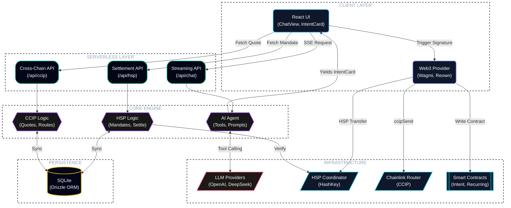

<p align="center">
  
</p>

## Table of Contents
- [HSK.ai](#hskai)
- [Features](#features)
- [Supported Chains](#supported-chains)
- [Installation](#installation)
- [Architecture](#architecture)


# HSK.ai

Sending a crypto payment normally means knowing which chain you're on, having the right address, holding the right gas token, and — if the recipient is on a different chain — routing the asset through a bridge yourself. HSK.ai takes a plain-language instruction like "send 5 USDC to Bob" and does that resolution work in the background: matching the recipient, checking balances, picking a route, and getting the transaction signed and settled.

The part worth explaining is what happens between the sentence and the signature. A single instruction requires the agent to look up the recipient against a saved contact list, check native and token balances across nine separately connected chains to see whether the payment is even possible, and construct an EIP-712 typed mandate — a structured, signable payload rather than a raw transaction — for the HashKey Settlement Protocol (HSP) to act on. If the recipient is on a different chain than the sender, the agent routes CCIP-BnM tokens from Ethereum Sepolia to Base, Arbitrum, Optimism, Polygon, or Avalanche through Chainlink's CCIP network, and it does this by reading the fee quote directly off the router contract at request time rather than using a fixed estimate. All of that — who, how much, which route, what it costs — gets shown to the user as one intent card before anything is broadcast. The wallet, not HSK.ai, is what actually signs and holds the funds; the app never has custody at any point.

The agent doesn't stop once the intent is built, either. It stays attached through broadcast, block confirmations, and final settlement, and returns a receipt that can be checked independently against the chain rather than just trusted. Every payment intent is also written to HashKey Mainnet as a permanent record, so a transaction executed on testnet still leaves the same kind of traceable history a mainnet payment would.

Demo Link (BETA): https://hskai.netlify.app

## Features

- **Multilingual** — English and Japanese UI with runtime language switching; no reload required
- **Multichain** — WalletConnect / Reown AppKit connects the wallet and adds all 9 supported chains automatically (HashKey Testnet & Mainnet, Ethereum, Sepolia, Base Sepolia, Arbitrum Sepolia, OP Sepolia, Polygon Amoy, Avalanche Fuji); cross-chain settlement runs through the Chainlink CCIP Router, with HashKey Chain as the primary network
- **AI Chat Interface** — A tool-calling agent that converts a plain-language request into a structured payment intent; nothing is broadcast until the request has been compiled into an intent card and confirmed
- **HSP Integration** — Uses the HashKey Payment (HSP) SDK for mandate signing, coordinator registration, and settlement, with each transaction linked to its explorer record
- **Cross-Chain CCIP Bridge** — Sends CCIP-BnM tokens from Ethereum Sepolia to Base, Arbitrum, Optimism, Polygon, or Avalanche testnets via Chainlink CCIP; includes live fee quoting, ERC-20 approval handling, and CCIP explorer message tracking (testnet-only for now)
- **Payment Intent Anchoring** — Writes each payment intent hash to HashKey Chain Mainnet (chain ID 177) as a permanent on-chain record, with automatic wallet-network switching and anchoring status tracked against the deployed mainnet and testnet contracts
- **Recurring Payments** — Schedules recurring USDC transfers on-chain through the HSKRecurringAnchor contract on HashKey Mainnet, on weekly, biweekly, or monthly cadences, with execution history tracked per schedule
- **Contacts & Address Book** — Save a name once and the agent resolves it to the correct wallet address automatically on future requests
- **Payment History** — One log covering transaction status, anchoring records, HSP verification, and CCIP message tracking
- **Token Balance Awareness** — Native (HSK/ETH) and ERC-20 (USDC, CCIP-BnM) balances are checked live across every connected chain, and the agent's suggestions are based on what's actually available
- **Multi-Provider AI** — Bring your own API key for OpenAI, DeepSeek, Kimi, local Ollama, or any OpenAI-compatible endpoint; the key is stored in browser localStorage and never sent to a server
- **Intent Confirmation Flow** — Every payment requires explicit confirmation via an intent card showing recipient, amount, token, network, fee breakdown, and settlement route before broadcast
- **Transaction Receipt Tracking** — Block confirmations, revert detection, and finalization status tracked live via viem's `waitForTransactionReceipt`

## Installation

Five commands from a clean clone to a running instance; the app flags anything missing (like the HSP key) as you go.

### Prerequisites

- [Node.js](https://nodejs.org/) 18+ and npm
- A wallet (MetaMask, Rabby, etc.)
- An AI provider API key (OpenAI, DeepSeek, or any OpenAI-compatible endpoint)

### Steps

```bash
git clone --recursive https://github.com/SuReaper/HSK.ai.git
cd HSK.ai
```
<p align="center">
  
</p>

```bash
npm install
```
<p align="center">
  
</p>

```bash
cp .env.example .env.local
```
<p align="center">
  
</p>

```bash
#    Register at https://hsp-hackathon.hashkeymerchant.com/register
#    Set HSP_API_KEY in .env.local
#    Without it the app runs in read-only mode (observe + verify, no settle).
```
<p align="center">
  
</p>

```bash
npx next build --webpack
npx next start
```
<p align="center">
  
</p>

Now open [http://localhost:3000](http://localhost:3000).

### Post-Setup for testing

1. **Connect your wallet** — the app provisions all 9 supported chains automatically on connection
2. **Configure your AI provider** — click the gear ⚙️ next to the chat input, enter your API key and endpoint
3. **Get test tokens** — for CCIP-BnM tokens, visit the [CCIP Faucet](https://faucets.chain.link/ccip); for HSK testnet tokens, use the HashKey Testnet faucet
4. **Start chatting** — try "Send 0.01 CCIP-BnM to Alice on Base Sepolia" or "Send 5 USDC to Bob or this or that address."
5. Switch to mainnet at any time to settle against HashKey Chain Mainnet directly.
> If `--recursive` was forgotten during clone, run `git submodule update --init` to fetch the HSP SDK.

## Supported Chains

Nine networks, covering HSK's own chains plus the EVM testnets used for cross-chain routing:

| Chain | ID |
|---|---|
| HashKey Testnet | 133 |
| HashKey Mainnet | 177 |
| Ethereum Sepolia | 11155111 |
| Base Sepolia | 84532 |
| Arbitrum Sepolia | 421614 |
| Optimism Sepolia | 11155420 |
| Polygon Amoy | 80002 |
| Avalanche Fuji | 43113 |

## Architecture

Four layers: the client captures intent and gets it signed, the serverless layer routes requests between them, the core engine builds mandates and quotes routes, and the on-chain layer is where settlement actually happens.




## Graph

<p align="center">
  
</p>


